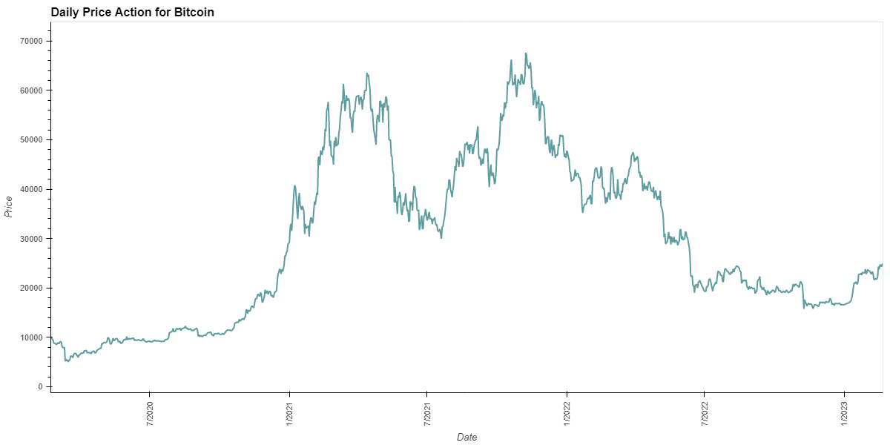
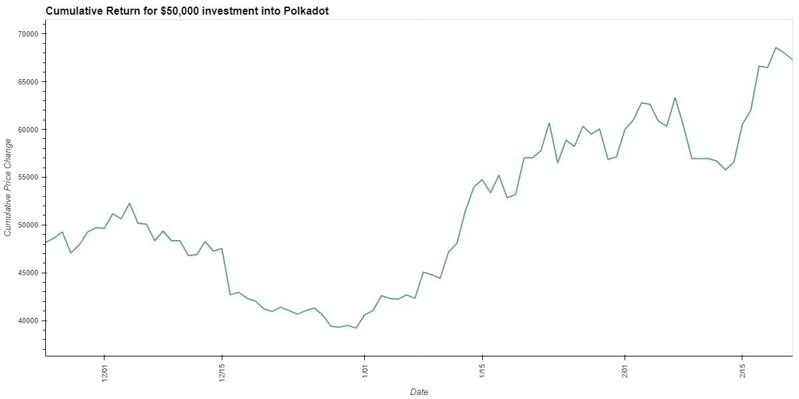
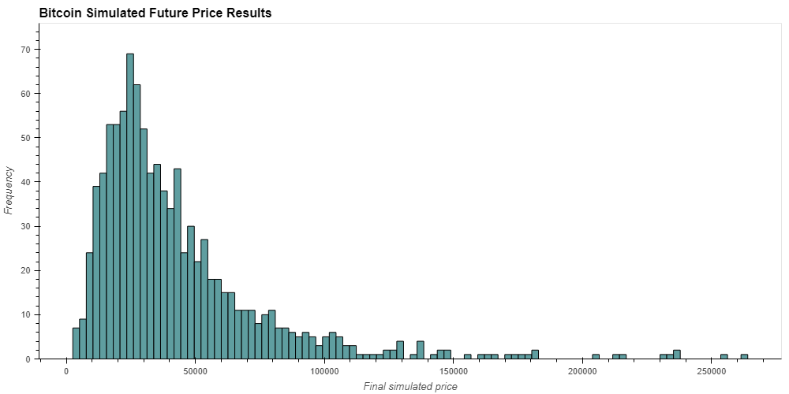
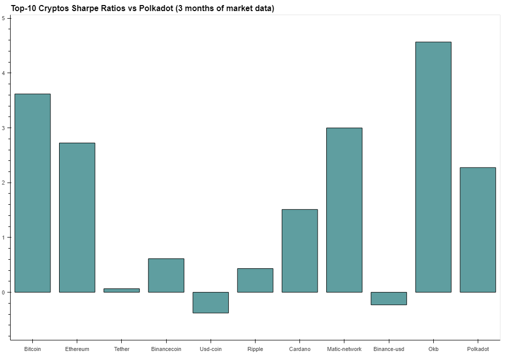

# Cryptocurrency Market Data Analyzer Application
---
## Project Idea Explained:
Our goal with this project is to create an application that will allow you to input a crypto currency and by using a combination of market data as well as social and news sentiment analysis, determine past performance, risk assessments and make predictions as to its future performance. We connected with market data APIs (CoinGecko API) as well as News APIs (Alyien News API) to gather data, perform analysis on, and forecast future action. 

### The market data component of the project will contain the following components:
---
#### 1. Data Gathering and User Interface - Market Data:

Usin CoinGecko's free public API we were able to retrieve market data without the requirement of API Keys. We want to make it so anyone can open our application and perform a search for a crypto of their choice to gain insight into whether it is something they want to invest in. Therefore we have incorportated several input() functions to tailor the data retrieval to the individual. The input requests are as follows:

    - "Please enter the full name of the cryptocurrency you want to search: "
    - "What country do you live in? Please use your country's initials for your answer: "
    - "Are you a day trader? (yes/no): " OR "Are you a long-term investor? (yes/no): "

Through these questions we determine what crypto to retrieve data for and on what time frame depending on the answers given. If interested in day trading, we retrieve the last 3 months market data, and if a long term investor, we retrieve 3 years of historical data. 

An additional fun incorporation to the application is the response from the program after your input responses are given. It summarizes your preferences and then tells you what calculations it is going to perform. 

Next we retrieve the data according to the specifications outlined by the user. Setting the users time_frame to a specified number of days, we know how many days of data we will retrieve. We've kept it simple in terms of data requested to only 'Close Price', 'Volume', and 'Market Cap'. One difficulty from this is that cryptocurrency is traded 24/7 so there technically is no open or close in the traditional sense like the stock market. We got around this by taking a: 

    - Resample of the data to daily frequency and kept only the last value of the day. 
            marketData_df = marketData_df.resample('D').last()
            
Additionally we perform a second data request for the Top 10 cryptocurrencies by market cap to perform a Sharpe Ratio calculation. This is to compare the crypto the user requests vs the Top 10 in terms of performance and risk. Additional python logic incorporated heavily into market data requests are the use of for loops. 
            
#### 2. Data Processing -  Market Data:
During the data request we create a pandas dataframe and set the column names, set the index to Date and perform pd.to_datetime of the created dataframe to format how we want. This cuts down a lot of the additional data processing that would be required to run analysis. From there we only have to round the 'Close Price' to help our plots format cleaner. From there we are able to drop columns as needed to perform different analyses. 

#### 3. Data Analysis and Data Visualization: - Market Data:
We perform various types of analysis on the data collected using tools such as Pandas, Numpy, Matplotlib, holoviews, bokeh, to perform these financial analyses in Python. The following calculations were done:

    - Plotting Daily Price Action of selected crypto:
   
   
   
    - A cumulative return for an example $50,000 investment over time frame:
    
   
   
    - Monte Carlo Simulation for price prediction in 1 year:
    
   
   
    - Sharpe Ratios for Top 10 Cryptos vs Selected Crypto (if not already in the Top 10)
   
   
 

Through the use of these calculations visualized by the plots shown, we can determine the historical performance of any cryptocurrency the user wishes to search, make an estimation on price action in the future, and see how the user's cryptocurrency has faired in terms of risk/reward vs other top cryptocurrencies.  

